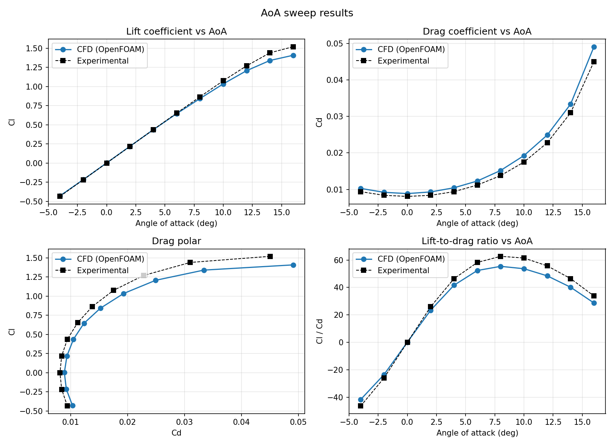

# Automated OpenFOAM Workflow for 2D Airfoil Analysis

From a raw ANSYS Fluent mesh to a validated lift and drag polar with a single command. The workflow automates mesh
conversion, case setup, an angle-of-attack sweep, convergence checks, post-processing and plots. It is demonstrated
and validated on a **NACA 0012** airfoil against NASA wind-tunnel data at **Re = 3 million**.



## What is automated

| Step | What the code does |
|---|---|
| Mesh intake | Reads the airfoil surface from the raw `.msh`, detects the rotation (0, 90, -90 or 180 deg) that puts the chord along +X with the leading edge upstream, and converts with `fluentMeshToFoam` |
| Boundary patches | Classifies airfoil, farfield and empty patches by name and type, and corrects the farfield patch type so wall distance is not computed against the freestream boundary |
| Mesh-aware solver setup | Parses `checkMesh` (non-orthogonality, aspect ratio, skewness) and selects non-orthogonal correctors, relaxation factors and SIMPLEC to match the mesh quality instead of using one fixed setting |
| Normalisation | Reads the real domain span from the `checkMesh` bounding box so force coefficients use the correct reference area |
| Case generation | Writes U, p, k, omega, nut, schemes, solution and controlDict; freestream conditions and wall functions; k and omega estimated from turbulence intensity and length scale; y+ monitoring added automatically |
| AoA sweep | Rotates the freestream vector and the lift and drag directions for each angle and warm-starts every angle from the previous solution. The absolute `endTime` is recomputed from the time actually reached, so later angles never silently run zero iterations |
| Convergence | Residual targets plus a force-stability check, a time limit per angle, optional parallel runs |
| Outputs | Results CSV rewritten after every angle (partial results survive an interruption), per-angle logs, and four-panel plots with the experimental data overlaid |

## Case

| Item | Value |
|---|---|
| Airfoil | NACA 0012, chord 1 m |
| Freestream | U = 43.8 m/s, Re about 3 x 10^6 (nu = 1.46e-5 m^2/s) |
| Solver | OpenFOAM v2512 (openfoam.com), steady `simpleFoam` (SIMPLEC when the mesh quality allows it, chosen automatically from `checkMesh`) |
| Turbulence | k-omega SST, fully turbulent, Spalding wall function for nut |
| Convection schemes | `linearUpwind grad(U)` for U, `limitedLinear 1` for k and omega (second order) |
| Mesh | 2D ANSYS Fluent mesh converted with `fluentMeshToFoam`. TODO: add cell count and y+ range |
| Freestream turbulence | TODO: add the intensity I (%) and length scale L (m) you used |
| Sweep | -4 to 16 deg in 2 deg steps (11 angles), each angle warm-started from the previous one |
| Reference data | NASA / Ladson wind-tunnel data at Re = 3 million, M about 0.15 (`experimental_data.csv`) |

## Results

| AoA (deg) | Cl CFD | Cl exp | Cl error | Cd CFD | Cd exp | Cd error |
|---|---|---|---|---|---|---|
| -4 | -0.4286 | -0.436 | -1.7% | 0.01029 | 0.0094 | +9.5% |
| -2 | -0.2168 | -0.218 | -0.6% | 0.00922 | 0.0084 | +9.8% |
| 0 | 0.0009 | 0.000 | - | 0.00887 | 0.0081 | +9.5% |
| 2 | 0.2185 | 0.218 | +0.2% | 0.00933 | 0.0084 | +11.0% |
| 4 | 0.4351 | 0.436 | -0.2% | 0.01046 | 0.0094 | +11.3% |
| 6 | 0.6446 | 0.652 | -1.1% | 0.01231 | 0.0112 | +10.0% |
| 8 | 0.8420 | 0.865 | -2.7% | 0.01521 | 0.0138 | +10.2% |
| 10 | 1.0342 | 1.075 | -3.8% | 0.01928 | 0.0175 | +10.2% |
| 12 | 1.2068 | 1.270 | -5.0% | 0.02492 | 0.0228 | +9.3% |
| 14 | 1.3399 | 1.440 | -6.9% | 0.03338 | 0.0310 | +7.7% |
| 16 | 1.4082 | 1.520 | -7.4% | 0.04909 | 0.0450 | +9.1% |

What the comparison shows:

- **Lift:** within about 2% up to 6 deg, then the CFD curve bends earlier than the experiment (-7.4% at 16 deg).
  This is the usual RANS behaviour with early trailing-edge separation.
- **Drag:** consistently 8 to 11% above experiment. A fully turbulent model has no laminar run on the airfoil,
  which is the likely reason (not yet tested, see limitations).
- **Lift slope:** about 0.108 per degree (experiment about 0.109).
- **Symmetry:** the sweep includes negative angles on purpose; Cl at -4 deg and +4 deg differ by about 1.5%.
- **Peak L/D:** 55.4 at 8 deg in the CFD, 62.7 in the experimental data.

## How convergence is judged

Residuals alone were not enough: at AoA = 0 the drag coefficient was still 2% low at iteration 1000 even though the
residuals looked small. An angle is therefore marked `converged = True` in the results CSV when **either**:

1. `simpleFoam` reports that all `residualControl` targets (1e-6 for p, U, k, omega) were met, **or**
2. Cd and Cl are stable over the last 100 iterations (Cd changes by less than 0.05%; Cl by less than
   max(0.05% of Cl, 1e-4)).

Reported Cl and Cd are averaged over the last 10% of the iterations of each angle, so the start-up transient of the
run never enters the numbers.

## Requirements

- OpenFOAM v2512 (openfoam.com distribution) with `fluentMeshToFoam`, `checkMesh`, `simpleFoam` on the path
- Python 3
- `matplotlib` is optional: without it the plots are written as a dependency-free SVG instead of a PNG

## Usage

1. Put your ANSYS Fluent `.msh` file in the working directory, together with the two scripts.
2. Run `python3 run_aoa_sweep.py` and answer the prompts (freestream velocity, viscosity, chord, turbulence
   intensity and length scale, angle range and step, iterations per angle, time limit per angle, CPU cores).
3. Results appear in `results/`:
   - `aoa_sweep_results.csv`: Cl, Cd, Cl/Cd, standard deviations and the convergence flag per angle
   - `sweep_plots.png` (or `sweep_plots.svg`): Cl-AoA, Cd-AoA, drag polar and Cl/Cd-AoA
   - `aoa_<angle>/`: log and post-processing data for each angle
4. To overlay experimental data on the plots, keep `experimental_data.csv` (columns `AoA_deg, Cl, Cd`) in the
   results folder, the case folder, or next to the script. Without it, only the simulation is plotted.

Choose the freestream turbulence so that nut/nu in the freestream is small (about 1 to 10 for external
aerodynamics). With U = 43.8 m/s, I = 0.5% and L = 0.01 m the ratio is about 100, which inflates the drag.

## Repository layout

```
.
|-- run_aoa_sweep.py          angle-of-attack sweep, convergence checks, results CSV and plots
|-- run_pipeline.py           mesh conversion and case setup helpers used by the sweep
|-- experimental_data.csv     NASA / Ladson reference data (Re = 3 million)
|-- plot_results.py           optional standalone plotter for an existing results CSV
|-- docs/
|   `-- sweep_vs_experimental.png
`-- README.md
```

## Limitations and next steps

- No mesh-independence study yet.
- Fully turbulent model with no transition modelling; a transition model (gamma-Re-theta) is the next test for the
  Cd offset.
- One Reynolds number; the sweep stops at 16 deg, before the maximum lift.
- The experimental table is perfectly symmetric about zero, so it is probably a smoothed or symmetrised version of
  the measurements. Check the original report before quoting exact numbers.

### Known issue

In `run_pipeline.py`, running the script on its own in turbulent mode calls `generate_momentum_transport`, which is
not defined (the function in the file is `generate_turbulence_properties`). `run_aoa_sweep.py` calls the correct
name and is not affected.

## Reference

Ladson, C. L., "Effects of Independent Variation of Mach and Reynolds Numbers on the Low-Speed Aerodynamic
Characteristics of the NACA 0012 Airfoil Section", NASA TM-4074, 1988.

## Acknowledgements

Part of the Python scripting was developed with AI assistance (Claude). The case setup, simulation runs, validation
against experiment and interpretation of the results are my own work.

Author: Mostafa Elsharkawy, Mechanical Power Engineering, Faculty of Engineering, Tanta University.
